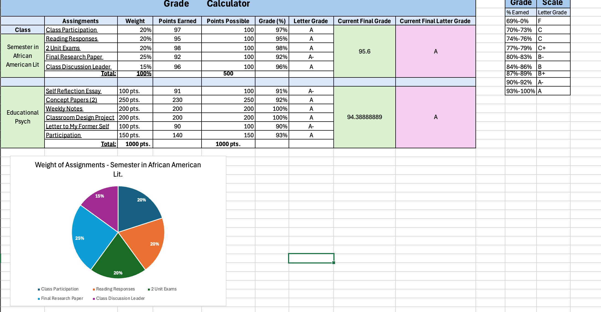
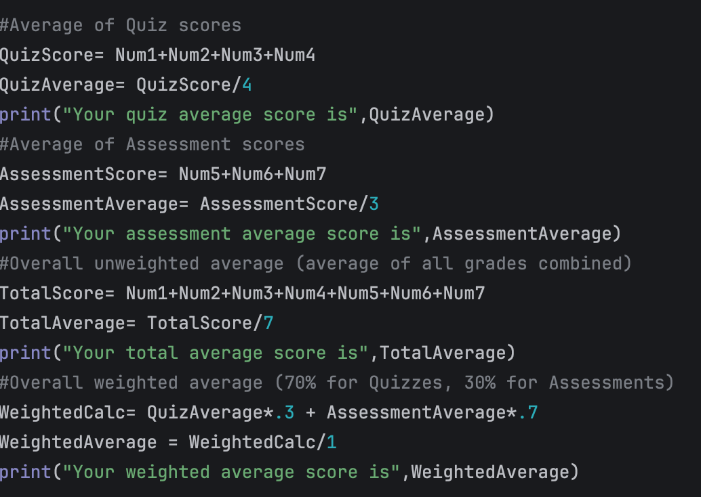
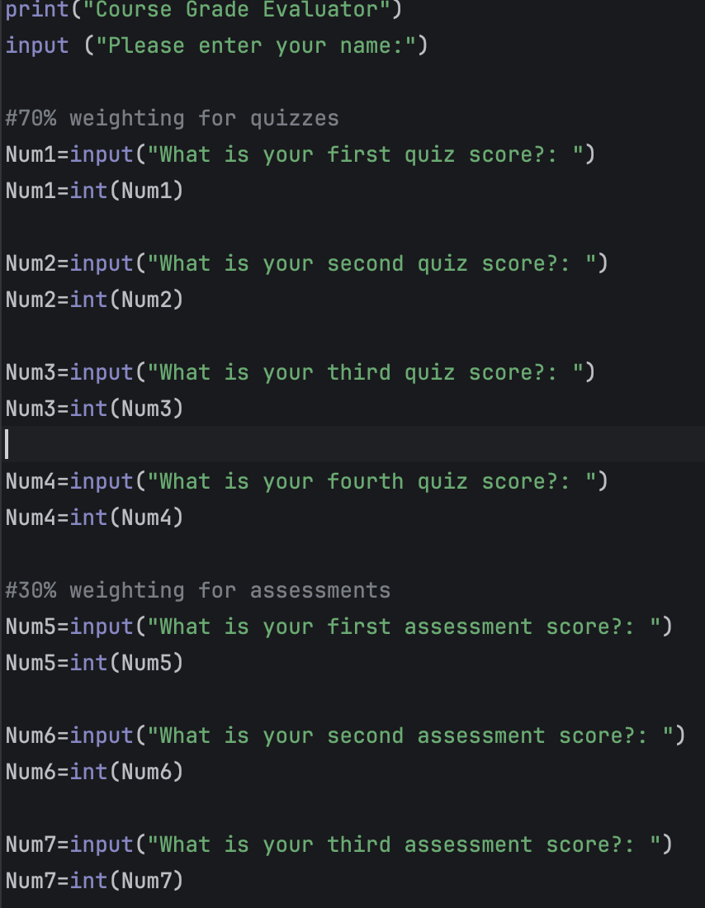
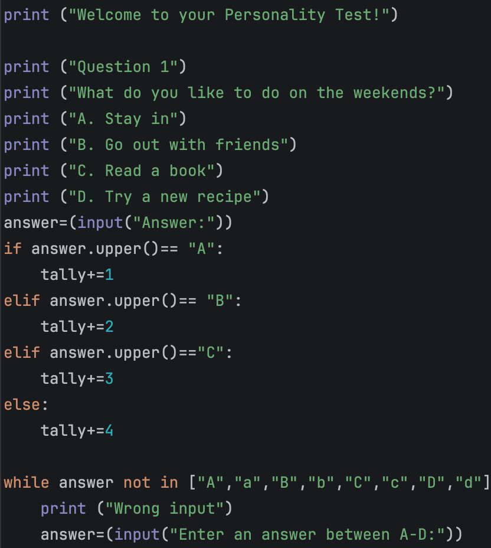

# CS108 Portfolio
# Marianna Varno

### My Portfolio

Contact Info: [mvarno@loyola.edu - 732-284-5275]
### About Me 

Hello! I intend to be a teacher in the future specializing in English. With skills in organization, communication, creativity, and compassion, I will be able to teach effectively, and achieve well-rounded, smart students. I am adept at using Google Applications, Python, and Excel. My diverse skill set, commitment to teaching, and passion for English makes me a valuable asset. In my spare time, I like to read and play softball.

### Education 
I am in my undergraduate at Loyola University Maryland.

### Projects

#### Grade Calculator Excel 
 - In this project, I worked to set up a grade calculator on Excel to keep track of my grades throughout this semester. I am able to place the letter grade into the calculator and it calculates how it will effect my overall average. It also includes a pie chart with the weights of the assignments.  
 - [Grade Calculator Excel](https://studentsloyola-my.sharepoint.com/:x:/r/personal/mvarno_loyola_edu/_layouts/15/Doc.aspx?sourcedoc=%7B211A50B9-4C95-4904-AAA3-605103181227%7D&file=Marianna%20Varno_Excel%20Assessment_CS108_1pm.xlsx&action=default&mobileredirect=true)
 -  
 - I achieved my goal that I set out by utilizing Excels SUM functions and the pie chart feature. 

#### Grade Calculator Python
 - In this project, I had a similar goal, to set up a grade calculator, but this time on Python. It is more in-depth and includes weightings, quizzes, and assessments. 
 - [Grade Calculator Python](https://github.com/LoyolaUnivMD/sp26-cs105-python-week-3-Marianna-Varno/commit/421310ae0f3c14cb91208a2995e0fc87d813e0c5#diff-895c7cf183409f4f67fac4585896681b6a0230bfb34c4d465a4c60b840204791)
 - 
 - 
 - I achieved my goal that I set out by utilizing int, print, and input. Once the user is able to enter their scores, I programed it to calculate their total overall grade for the course.  

#### Personality Test 
 - In this project, I worked to make a 10 question personality quiz. Once completed, the user receives a personality matching the answers to their questions and a blurb about what it means.  
 - [Personality Test](https://github.com/LoyolaUnivMD/sp26-cs105-python-final-project-Marianna-Varno/blob/main/PersonalityTest.py)
 - 
 - I achieved my goals in this project by using creative questions and the if, elife, else statements. I also used the "tally" to calculate the scores of the 10 questions.  
